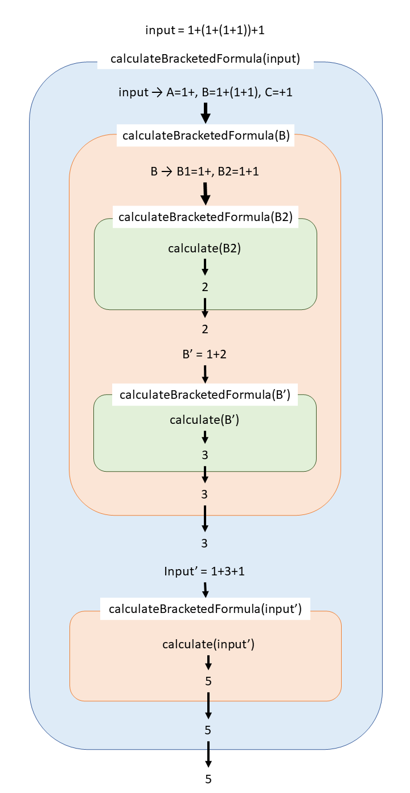

## 共通部分

宿題1~3にまたがって使う型と関数はそれぞれ[../src/scripts/week3/type.ts](../src/scripts/week3/type.ts)と[../src/scripts/week3/utils.ts](../src/scripts/week3/utils.ts)に定義した。型`Operator`は演算子として有効な文字、型`Token`は数式中の値として有効な数字と演算子を指す。

関数`tokenize`は、入力された文字列を数式として解釈し、`Token`型の配列を返す。もし、演算子として無効な文字が含まれていた場合は`null`を返す。演算子として有効な値は引数`validOperators`で与えられる。関数`readNumber`は文字列`input`と数字`idx`を引数として受け取り、`input[idx]`から始まる数字を小数点以下も含めて読み込み、読み込んだ数字と`idx`を返す。関数`readOperator`は文字列`input`と数字`idx`と演算子として有効な値`validOperators`を引数として受け取り、`input[idx]`が`validOperators`に含まれていればその値と`idx`を、含まれてなければ(`input[idx]`が演算子として無効な値だったら)`null`と`idx`を返す。

## 宿題1

ページ上で「計算」を押すと、その時の入力欄の中身を引数として[../src/scripts/week3/ex1.ts](../src/scripts/week3/ex1.ts)の`mainEx1`が実行される。まず、入力からスペースを除去したものと、`()`以外の演算子の配列を引数として`tokenize`を実行し、その戻り値を`tokens`で受け取る。もし、入力中に不正な演算子が含まれていた場合、`tokens`は`null`になっているので、その場合はエラーを返して終了する。その後、実際に計算を行う関数`calculate`に`tokens`を引数として与えて実行し、得られた戻り値が計算結果なので、それを返して終了する。

関数`calculate`は、掛け算と割り算のみを計算し、足し算と引き算のみになった数式を返す関数`calculateMultiplicationAndDivision`と、足し算と引き算のみの数式を計算し、その結果を返す関数`calculateAdditionAndSubtraction`を順に実行することで成り立っている。

`calculateMultiplicationAndDivision`では、`()`が無ければ数式中の演算子と数字は交互に現れるという性質を利用し、for文内で演算子のみを見ている。演算子が`+`, `-`だった場合は、戻り値になる足し引き算のみの数式`newTokens`に演算子とその次の数字を末尾追加し、演算子が`*`, `/`だった場合は、`newTokens`の末尾の値と今見ている演算子の次の値同士で掛け算又は割り算を行う。

`calculateAdditionAndSubtraction`でも同様に、演算子のみを見て、`+`なら戻り値となる`ans`に演算子の次の値を足し、`-`なら`ans`から演算子の次の値を引いている。

## 宿題2

`mainEx2`でひたすらテストを実行している。どこか一か所でもテストが通らないと`NG`が、全てのテストが通ると`OK`が返ってくる。

## 宿題3

ページ上で「計算」を押すと、その時の入力欄の中身を引数として[../src/scripts/week3/ex3.ts](../src/scripts/week3/ex3.ts)の`mainEx3`が実行される。まず、入力からスペースを除去したものと、演算子の配列を引数として`tokenize`を実行し、その戻り値を`tokens`で受け取る。もし、入力中に不正な演算子が含まれていた場合、`tokens`は`null`になっているので、その場合はエラーを返して終了する。その後、かっこを含む数式の計算を行う関数`calculateBracketedFormula`に`tokens`を引数として与えて実行し、得られた戻り値が計算結果なので、それを返して終了する。

`calculateBracketedFormula`では、まず`tokens`が`(`か`)`のみを含む無効な数式かどうかをチェックし、無効な数式だった場合はエラーを返して終了する。有効な数式だった場合、数式中にかっこが含まれていなければ、[../src/scripts/week3/ex1.ts](../src/scripts/week3/ex1.ts)で定義した`calculate`関数に`tokens`を与えて実行した戻り値を返す。数式中にかっこが含まれていた場合、先頭の`(`と対になる`)`を探し、見つかった`()`の中身部分の数式を引数に`calculateBracketedFormula`を実行。その戻り値と`()`の前後の数式をつなげた数式を引数に再度`calculateBracketedFormula`を実行した戻り値を返す。

### `calculateBracketedFormula`の計算例

入力：`1+(1+(1+1))+1`(=`input`)

1. `calculateBracketedFormula(input)`で`input`が`A=1+`, `B=1+(1+1)`, `C=+1`に分けられ、`calculateBracketedFormula(B)`が実行される
2. `calculateBracketedFormula(B)`で、`B`が`B1=1+`, `B2=1+1`に分けられ、`calculateBracketedFormula(B2)`が実行される
3. `calculateBracketedFormula(B2)`で、`B2`にかっこは含まれないので、`calculate(B2)`が実行され、`2`が返される
4. `calculateBracketedFormula(B)`に戻り、`B1`と`calculateBracketedFormula(B2)`の戻り値`2`をつなげた数式`B'=1+2`を引数に`calculateBracketedFormula(B')`を実行
5. `calculateBracketedFormula(B')`で、`B'`にかっこは含まれないので、`calculate(B')`が実行され、`3`が返される
6. `calculateBracketedFormula(B)`に戻り、`calculateBracketedFormula(B')`の戻り値`3`を返す
7. `calculateBracketedFormula(input)`に戻り、`A`と`calculateBracketedFormula(B)`の戻り値`3`と`C`をつなげた数式`input'=1+3+1`を引数に`calculateBracketedFormula(input')`を実行
8. `calculateBracketedFormula)(input')`で、`input'`にかっこは含まれないので、`calculate(input')`が実行され`5`が返される
9. `calculateBracketedFormula(input)`に戻り、`calculateBracketedFormula(input')`の戻り値`5`を返して終了する

図にすると下のようになる

